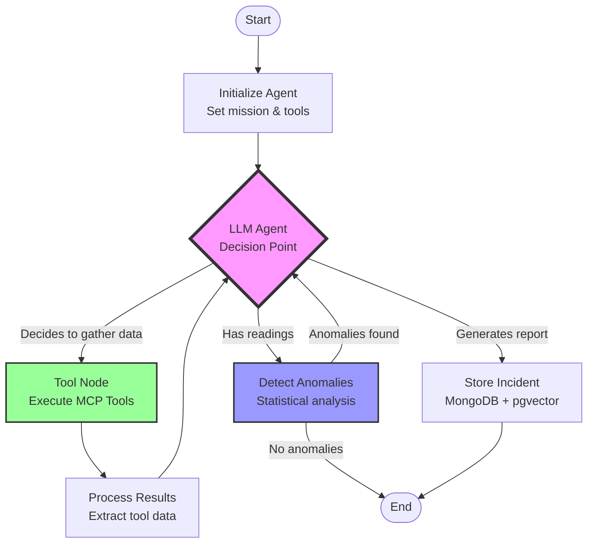

# Agentic Architecture - LangGraph + MCP Integration

## Overview

This document explains how the environmental monitoring system demonstrates **proper agentic AI** patterns using LangGraph and Model Context Protocol (MCP) tools.

## What Changed: From Pipeline to Agent

###  Before: Linear Pipeline ❌

```python
def run_cycle():
    1. Fetch flood readings (always)
    2. Fetch hydrology readings (always)
    3. Detect anomalies
    4. Fetch permits (if anomalies)
    5. Generate alert
    6. Store incident
```

**Problems:**
- No LLM decision-making
- Fixed execution order
- No tool calling
- Not agentic - just a deterministic workflow

### After: Agentic Workflow ✅

```python
def agentic_workflow():
    1. LLM decides which data to fetch
    2. LLM calls MCP tools (get_flood_readings, get_hydrology_readings)
    3. System analyzes for anomalies
    4. LLM decides if investigation is needed
    5. LLM calls search_public_registers if warranted
    6. LLM generates final incident report
    7. Store results
```

**Improvements:**
- ✅ LLM-driven decisions at every step
- ✅ MCP tool calling (not direct API clients)
- ✅ Conditional routing based on findings
- ✅ True agentic behavior

## Architecture Diagram



## Key Components

### 1. Agent State (TypedDict)

```python
class AgentState(TypedDict):
    messages: Annotated[list, add_messages]  # LLM conversation history
    flood_readings: list[dict]                # Tool results
    hydrology_readings: list[dict]            # Tool results
    all_readings: list[Reading]               # Processed data
    anomalies: list[Reading]                  # Detected issues
    permits: list[dict]                       # Regulatory context
    incident: Incident | None                 # Final output
    next_action: str                          # Routing hint
```

**Why this matters:** The state tracks both the LLM's reasoning (messages) and the structured data it gathers (readings, permits). This enables the agent to maintain context across multiple reasoning steps.

### 2. LLM Agent Node

```python
async def agent_node(state: AgentState) -> AgentState:
    """LLM agent that decides which tools to call."""
    llm = _get_llm()
    tools = _get_tools()  # MCP tools
    llm_with_tools = llm.bind_tools(tools)
    response = await llm_with_tools.ainvoke(state["messages"])
    return {**state, "messages": [response]}
```

**Key insight:** The LLM sees the conversation history and **autonomously decides** which MCP tools to call based on the mission.

### 3. MCP Tools (Not Direct Clients!)

```python
@tool
async def get_flood_readings(parameter: str = "level") -> dict[str, Any]:
    """Get latest flood monitoring readings from Environment Agency."""
    # Fetches data from EA API
    return {"readings": [...], "count": N}

@tool  
async def get_hydrology_readings(observed_property: str = "waterLevel") -> dict[str, Any]:
    """Get latest hydrology readings."""
    return {"readings": [...], "count": N}

@tool
async def search_public_registers(postcode: str, easting: int, northing: int, dist_km: int = 1) -> dict[str, Any]:
    """Search environmental permits near a location."""
    return {"entries": [...]}
```

**Why MCP tools?** The `@tool` decorator makes these functions:
- Discoverable by the LLM
- Type-safe with automatic validation
- Self-documenting (LLM reads the docstring)
- Standardized interface for agentic systems

### 4. Conditional Routing

```python
def route_after_agent(state: AgentState) -> Literal["tools", "process_data", "end"]:
    """Route based on what the agent decided to do."""
    last_message = state["messages"][-1]
    
    # If agent wants to call tools, route to tool node
    if isinstance(last_message, AIMessage) and last_message.tool_calls:
        return "tools"
    
    # If we have readings but haven't processed them yet
    if state["flood_readings"] or state["hydrology_readings"]:
        if not state["all_readings"]:
            return "process_data"
    
    # Otherwise, we're done
    return "end"
```

**Why this matters:** The graph adapts its execution path based on the LLM's decisions. This is **conditional routing** - a core agentic pattern.

### 5. Tool Execution Loop

```
Agent → [Decide to call tool] → Tools → Process Results → Agent → [Decide next action]
  ↑                                                                        ↓
  └────────────────────────[Loop until task complete]──────────────────────┘
```

The agent can call tools multiple times, gather data incrementally, and adapt its strategy based on what it finds.

## Execution Flow Example

### Scenario: Agent detects a flood event

1. **START** → Initialize with mission: "Monitor environmental sensors"

2. **Agent Node:** LLM reads mission and decides:
   ```
   "I should fetch the latest flood and hydrology data to check for anomalies"
   → Calls: get_flood_readings(parameter="level")
   → Calls: get_hydrology_readings(observed_property="waterLevel")
   ```

3. **Tool Node:** Executes both MCP tools in parallel
   - Fetches 2000+ flood readings
   - Fetches 7000+ hydrology readings

4. **Process Tools:** Extracts results from tool messages
   ```
   "Retrieved 2012 flood readings and 7837 hydrology readings"
   ```

5. **Agent Node:** LLM sees the update:
   ```
   "I now have the readings. The system should analyze them for anomalies."
   ```

6. **Detect Anomalies:** Statistical analysis finds 76 readings > threshold
   ```
   "Found 76 anomalous readings. Top 5 stations: 44239 (105.38), ..."
   ```

7. **Agent Node:** LLM sees anomalies and decides:
   ```
   "These readings indicate potential flooding. I should investigate 
   nearby environmental permits to assess regulatory context."
   → Calls: search_public_registers(easting=X, northing=Y, dist_km=3)
   ```

8. **Tool Node:** Fetches permits near affected area
   - Returns 50+ nearby permits

9. **Generate Incident:** LLM creates final report:
   ```
   "Flood level of 105.38 at station 44239 indicates significant event.
   Priority: HIGH. Recommended actions: Alert authorities, monitor nearby
   waste permits for compliance..."
   ```

10. **Store & END:** Save incident to MongoDB with alerts and permits

## Why This is "Agentic"

| Aspect | Old (Pipeline) | New (Agentic) |
|--------|---------------|---------------|
| **Decision Making** | Hardcoded in Python | LLM decides what to do |
| **Tool Usage** | Direct API clients | MCP tools called by LLM |
| **Execution Flow** | Fixed linear sequence | Dynamic based on findings |
| **Adaptability** | None - same steps every time | Adapts to data it discovers |
| **Reasoning** | No reasoning - just executes | LLM reasons about what's needed |
| **Context Awareness** | Stateless | Maintains conversation history |

## Benefits of This Architecture

1. **Explainability**: Can see the LLM's reasoning in message history
2. **Flexibility**: Add new tools without changing graph logic
3. **Intelligence**: LLM can adapt strategy based on what it finds
4. **MCP Standard**: Tools are reusable across different AI systems
5. **Composability**: Can combine this agent with other agents
6. **Debuggability**: Clear node boundaries make debugging easier

## Testing the Agentic Behavior

```bash
# Run the agent
uv run defra-agent-run

# Visualize the graph structure  
uv run python scripts/visualize_graph.py

# Test MCP tools directly
uv run python scripts/test_mcp_tools.py
```

## Key Files

| File | Purpose |
|------|---------|
| `src/defra_agent/agent/graph.py` | Agentic graph with LLM decision-making |
| `src/defra_agent/tools/mcp_tools.py` | MCP tool definitions (@tool decorators) |
| `src/defra_agent/agent/mcp_graph.py` | Alternative MCP-focused graph (simpler) |
| `mcp_servers/ea_env_server.py` | FastMCP server for external clients |
| `docs/MCP_INTEGRATION.md` | MCP architecture guide |

## Comparison with Traditional Agent Frameworks

### LangGraph Advantages

- **Explicit state management**: TypedDict defines exactly what data flows through
- **Visual graph structure**: Can generate Mermaid diagrams
- **Granular control**: Each node is a clear step
- **Conditional routing**: Decisions visible in graph structure
- **Tool integration**: First-class support for LangChain tools

### Why Not Just Use LangChain Chains?

Chains are linear (A → B → C). Agents need:
- Loops (gather more data if needed)
- Conditional branching (different paths based on findings)
- State persistence (remember what's been done)
- Tool calling (LLM decides which APIs to use)

LangGraph provides all of this with a clear, debuggable structure.

## Future Enhancements

Possible next steps to showcase more agentic capabilities:

1. **Multi-agent collaboration**: Separate agents for flood vs pollution monitoring
2. **Human-in-the-loop**: Ask user for confirmation before critical actions
3. **Memory**: Remember past incidents and learn from patterns
4. **Planning**: Multi-step plans before executing
5. **Self-correction**: Retry with different strategy if initial approach fails
6. **Streaming**: Real-time updates as agent progresses through workflow

## Conclusion

This architecture demonstrates **true agentic AI**:
- ✅ LLM makes decisions, not hardcoded logic
- ✅ MCP tools provide standardized interfaces
- ✅ Conditional routing adapts to findings
- ✅ Multi-step reasoning with state management
- ✅ Autonomous data gathering and analysis

The agent doesn't just execute a fixed pipeline - it **reasons** about what data it needs, **decides** which tools to call, **adapts** based on what it finds, and **generates** intelligent reports. This is the future of AI systems.
